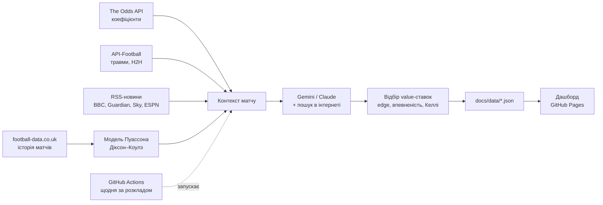

# BetAI ⚽ — AI-аналітика футбольних ставок

Платформа автоматично збирає коефіцієнти букмекерів, історію матчів, травми та новини.
Далі статистична модель і AI (Gemini або Claude) аналізують кожен матч, а результат —
**рекомендовані value-ставки** — з'являється на веб-дашборді (GitHub Pages).



## Як це працює

1. **Коефіцієнти.** The Odds API повертає найкращий і середній коефіцієнт на 1X2 та тотал 2.5 від десятків букмекерів.
2. **Модель.** З історії останніх сезонів оцінюються сила атаки й захисту кожної команди, причому свіжі матчі важать більше. Модель Пуассона з поправкою Діксона–Коулза дає ймовірності всіх рахунків.
3. **База.** Ймовірності моделі зважено поєднуються з «чесними» ймовірностями ринку (без маржі букмекера). Ринок дуже точний, тому має вагу 60%.
4. **AI-аналіз.** Gemini (безкоштовно) або Claude отримує форму команд, H2H, травми, новини, коефіцієнти й ймовірності. Через web search він сам шукає свіжі новини про склади й травми, коригує ймовірності (не більше ніж на ±12 п.п.) і пояснює своє рішення українською.
5. **Відбір.** Ставка рекомендується лише тоді, коли виконані всі умови: value ≥ 3%, коефіцієнт 1.40–5.00, впевненість AI ≥ 5/10. Розмір ставки визначається за ¼ Келлі з обмеженням до 3% банку.
6. **Трекінг.** Кожен наступний запуск розраховує результати, рахує ROI, вінрейт і **CLV**: чи кращий наш коефіцієнт за пізніший ринковий.

## Швидкий старт (5 хвилин)

### 1. Отримайте ключі

| Сервіс | Навіщо | Безкоштовно | Обов'язково |
|---|---|---|---|
| [The Odds API](https://the-odds-api.com) | коефіцієнти, результати | 500 кредитів/міс | ✅ |
| [Google AI Studio](https://aistudio.google.com/apikey) | AI-аналіз (Gemini + Google Search) | ✅ безкоштовний рівень | ✅ для AI |
| [Anthropic Console](https://console.anthropic.com) | AI-аналіз Claude (глибший) | ні (оплата за токени) | ❌ |
| [API-Football](https://www.api-football.com) | травми, H2H у всіх турнірах | 100 запитів/день | ❌ |

### 2. Додайте секрети в GitHub

`Settings → Secrets and variables → Actions → New repository secret`:

- `ODDS_API_KEY`
- `GEMINI_API_KEY` — безкоштовний AI
- `ANTHROPIC_API_KEY` (необов'язково, платно) — щоб перейти на Claude, задайте змінну `Variables → AI_PROVIDER = claude`
- `API_FOOTBALL_KEY` (необов'язково)

### 3. Увімкніть дашборд

`Settings → Pages → Source: Deploy from a branch → main / docs`.

Дашборд буде доступний за адресою `https://<username>.github.io/<repo>/`.

### 4. Дозвольте Actions комітити

`Settings → Actions → General → Workflow permissions → Read and write permissions`.

### 5. Запустіть

`Actions → Update predictions → Run workflow`. Далі платформа запускатиметься автоматично щодня о ~09:00 за Києвом.

> Поки `ODDS_API_KEY` не задано, workflow працює в **демо-режимі** на синтетичних даних.

## Локальний запуск

```bash
pip install -r requirements.txt
cp .env.example .env      # вставте ключі
python -m betai --demo    # демо без ключів
python -m betai run       # реальний запуск
cd docs && python -m http.server 8000   # дашборд: http://localhost:8000
pytest -q                 # тести
```

## Налаштування — `config.yaml`

- **leagues** — турніри: УПЛ, Ліга націй, відбори ЧС та Євро, товариські матчі збірних, ЛЧ, ЛЄ, ЛК, топ-5 ліг. Порядок у списку задає пріоритет, а `priority: true` означає, що AI аналізує ці матчі першими.

### Покриття турнірів

| Турнір | Коефіцієнти | Статистична модель | Що показує дашборд |
|---|---|---|---|
| Топ-5 ліг | ✅ | ✅ | value-ставки |
| ЛЧ, ЛЄ, ЛК, Ліга націй, відбори | ✅ | — (AI + ринок) | value-ставки |
| УПЛ, товариські матчі збірних | ❌ немає в безкоштовному джерелі | — | AI-прогноз + **мінімальний коефіцієнт**, з яким ставка має сенс |

Розклад і результати беруться з публічного API ESPN (без ключа), тож розрахунок ставок не витрачає кредитів The Odds API.
- **picks** — пороги value, коефіцієнтів, впевненості, параметри Келлі.
- **ai** — модель, кількість матчів на запуск, web search.
- **model** — вага ринку, глибина історії, швидкість «забування» старих матчів.
- **news.feeds** — RSS-джерела.

## Витрати та ліміти

- **The Odds API.** Один запуск на 4 ліги коштує ≈ 8 кредитів за коефіцієнти і до 8 за результати. При одному запуску на день це ≈ 480 кредитів на місяць, тобто вкладається у безкоштовний план. Для двох запусків на день або більшої кількості ліг потрібен платний план (від $30).
- **Gemini (за замовчуванням)** — безкоштовний рівень Google AI Studio: ≈ 12 запитів на день із Google Search, що вкладається в ліміти. Врахуйте, що на безкоштовному рівні Google може використовувати запити для покращення своїх моделей, а самі ліміти Google може змінювати.
- **Claude (опційно)** — ≈ $0.5–1.5 на день на Sonnet.
- **GitHub Actions / Pages** — безкоштовно для публічних репозиторіїв.

> 🔒 **Приватність.** На безкоштовному плані GitHub Pages працює лише з публічних репозиторіїв. Тоді дашборд буде доступний за посиланням (сторінка закрита від індексації). Для приватного репозиторію потрібен GitHub Pro, або дашборд можна дивитися локально.

## Структура

```
betai/
  sources/   odds.py · history.py · fixtures.py · news.py · demo.py
  model/     poisson.py (модель) · value.py (value, маржа, Келлі)
  ai/        analyst.py (Claude API, web search, валідація JSON)
  pipeline.py  — оркестрація
  tracker.py   — розрахунок ставок, ROI, CLV
docs/        — дашборд (HTML/CSS/JS) + data/*.json
.github/workflows/  update.yml (за розкладом) · tests.yml
```

## Як читати результати

- **Value (edge)** = ймовірність × коефіцієнт − 1. Це очікуваний прибуток на одиницю ставки, *якщо* оцінка ймовірності правильна.
- **CLV** — головний індикатор якості. Якщо коефіцієнт до старту падає нижче того, за яким ми ставили, значить ринок «погодився» з нами. Стабільно позитивний CLV на 100+ ставках набагато важливіший за короткострокову серію виграшів.
- **Перші 200–300 ставок** — це перевірка, а не заробіток. Дисперсія у ставках дуже велика.

## ⚠️ Відповідальна гра

18+. Платформа — інструмент аналітики, а не гарантія прибутку. Більшість гравців у довгостроковій перспективі програють букмекерам. Ставте лише ту суму, яку готові втратити, встановлюйте ліміти й робіть перерви. Якщо ставки перестають бути розвагою, зверніться по допомогу.
